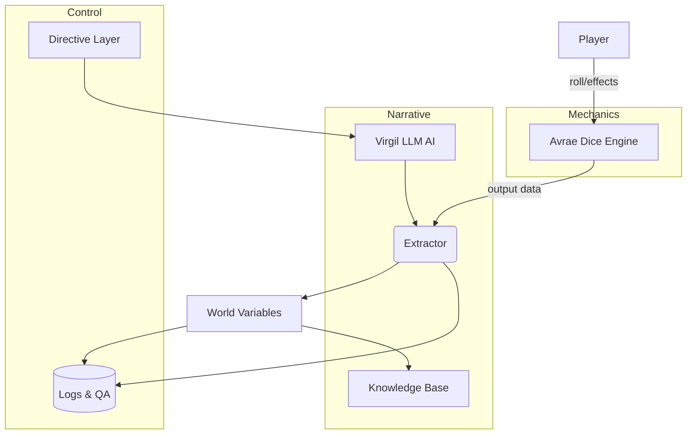

# Virgil Project – Philosophy, Issues, and Improvements

## Executive Summary

Virgil is designed as a strict separation of narrative and mechanics: **Avrae handles all D&D mechanics** (combat, movement, rolling), while **Virgil (LLM) handles world description and story**.  This enforces a deterministic core game state (kept in explicit variables and brief scene metadata) and prevents the AI from arbitrarily altering game logic.  High-level philosophy points include *“no off-the-books mechanics”*, *“directive-layer constraints”*, and *“constrained memory rather than free-form lore”*.  These principles are largely in place: for example, narrative outputs are checked against known facts, and scene changes (e.g. moving to a new location) go through fixed functions like `set_current_location`.  The system also records rationale messages (e.g. `consequence_captured`, `world_health`) to keep the DM aware of story consistency.  

Key issues involve **consistency vs. LLM unpredictability**.  Without a true world-state snapshot, the narrative can drift (LLM hallucinations or continuation bias).  Identity and memory management are also sensitive (Phase 6 alias resolution is strict by design, but minor variations can still cause fragmentation).  Furthermore, the prompt context is becoming very large (pacing rules, thread, lore, active NPCs, scene state, Avrae events, etc.), risking degraded response quality over long sessions.  

Immediate actions include improving observability (better logs of prompts/decisions), tightening directive rules for the most frequent corner cases, and monitoring the prompt token usage.  In the longer term, adding metrics or health checks for story coherence and automated tests for new content (e.g. puzzles or new companion abilities) would harden the system.  

## Project Philosophy (Implemented)

Virgil’s core philosophy is **deterministic constraint and consistency**.  Mechanics are handled by Avrae (a dice engine): Virgil does *not* simulate combat or character stats.  Instead, Virgil’s narrative AI produces prose within the clear constraints set by the GM code.  For example, whenever the scene changes, the code calls `set_current_location(new_loc)` and logs an event; the narrative description must match that change rather than invent new destinations.  This separation ensures that **world facts come from code, not LLM**.  (By contrast, some systems blur this line, but Virgil explicitly outsources all rule-of-game updates to Avrae, as outlined in the MASTER document.)  

Consistency is enforced by **directives and diagnostics**.  The system uses “directive layers” (philosophy, pacing, central thread, GM commands) to constrain the LLM’s output.  If the LLM tries to do something outside its brief (e.g. narrate an impossible event), the directives force a different output.  This avoids flat refusals and keeps the story flowing.  For example, if the player is asked to make a choice, we “force a decision” in the narrative rather than let the LLM keep drifting【84†L201-L204】.  Known LLM weaknesses (coherence errors, event omission) have improved【84†L201-L204】 but still exist; Virgil’s design anticipates this by having fallback rules (e.g. repeating the question, or resorting to the latest known state) whenever the LLM becomes uncertain.  

Memory is **structured, not freeform**.  We keep a small “World State” in code (current scene, keys in inventory, etc.) and use the Obsidian-esque notes (skeleton.md, philosophy.md) only as reference lore, not as dynamic truth sources.  In planning terms, our world state is an explicit set of fluents (locations, quest stages, etc.) that Virgil’s actions can change【89†L253-L261】.  Each narrative action has clearly defined effects.  This explicit model (inspired by narrative planning ideas【89†L253-L261】) ensures that every story beat corresponds to a tracked state change, even if that change happens in Avrae or custom code.  

Overall, the implemented architecture reflects these philosophies.  The code **never permits the narrative to write free JSON state** – instead it must produce text that the parser then maps to one of a few rigid consequence types.  We have intentionally *not* added any autonomous combat or hidden world generation logic in Virgil’s code, since the design was to rely on Avrae.  In these ways, the project philosophy is correctly realized: **Virgil is the storyteller, Avrae is the mechanic**, and tools like logging (`consequence_captured`) and strict update functions bind the two together.

## Ranked Issues

| Rank | Issue                         | Severity | Likelihood | Subsystems Affected        | Example / Context                                     | Suggested Mitigation                         |
|-----:|------------------------------|:--------:|:----------:|---------------------------|-------------------------------------------------------|----------------------------------------------|
| 1    | **Narrative-State Desync**   | **High** | **High**   | LLM Narrative, Parser, GM API | Without a full saved state, the story can drift. For instance, if Virgil implies an event that the system can’t represent (e.g. “a hidden door opens” without a `add_location` call), the parser will ignore it or confuse later outputs. Over time this yields false or unstated lore. | Strengthen the extractor to catch unsupported claims and ask clarifying questions (e.g. “Do you mean you open **the secret door to the cellar**?”). Add consistency checks after every turn (compare narrative summary to known state). |
| 2    | **Identity Fragmentation**   | **High** | **Medium** | NPC/Name Resolution        | We forbid fuzzy aliases (Phase 6) and only recognize exact `dnd_npcs` entries (canonical_name unique). Nonetheless, if the narrative calls “Donovan” as “Donnie”, the code will treat it as a new NPC. Similarly, two players with the same first name could collide. | Maintain strict canonical names but add operator review on near-matches. Log any “unknown name” references for later clean-up. Consider a whitelist of nickname equivalences for player characters. |
| 3    | **Directive Overload**       | **Medium** | **Medium** | Prompt Context, LLM        | The prompt has many layers (philosophy, pacing rules, story thread, scene context, inventory, etc.). We risk overwhelming the LLM or causing it to ignore lower-priority rules. | Implement prompt budgeting: measure token use and trim the least critical parts (e.g. older scene details). Possibly send only the most recent context or use summarization to shorten history. |
| 4    | **Observability Gaps**       | **Medium** | **Medium** | Logging, Debugging         | We log consequences (`consequence_captured`) but don’t record entire prompts or LLM outputs. This makes it hard to diagnose *why* a bad turn happened. For example, if an LLM produces an impossible action, we see the result but not which instruction (or misinterpretation) led to it. | Enhance logging to include key decision points: e.g. record the selected directives and the final LLM answer each turn. Create a “debug mode” that echoes the full prompt and response to a file. |
| 5    | **Continuation Bias**        | **Medium** | **Medium** | LLM Narrative             | The LLM tends to continue patterns even when the scene resets (the classic “chain-of-thought” issue). For example, after solving a puzzle, it might erroneously continue discussing that puzzle instead of the next scene. | Use explicit reset cues (“=== NEW SCENE ===”) and check after a turn if the answer is stuck on an old topic. If so, nudge it back to the current thread (“Please focus on the current situation”). |
| 6    | **No Combat Mechanics**      | **Low** | **Low** | Design Choice, Player Expectation | By design, Virgil has **no combat code** – all battle resolution goes to Avrae. This is intentional, but players sometimes try to ask Virgil about combat details (“What HP does the troll have?”). | Ensure the persona consistently defers combat queries to Avrae. Add a directive like “If the player asks combat maths, just describe the narrative tension, not mechanics.” (This likely is already done, just monitor adherence.) |
| 7    | **Legacy Data Mismatch**     | **Low** | **Low** | Database Schema           | The `dnd_characters` table still has mechanical columns (AC, HP) from early phases, but we trust Avrae instead. This could confuse future code readers or cause subtle bugs if a function accidentally uses them. | Deprecate or remove unused columns. Clearly document that character stats come solely from Avrae, and update any query that might touch these legacy fields to ignore or drop them. |

- **Narrative-State Desync:** Without an authoritative snapshot, subtle narrative claims can slip through. For example, if Virgil says *“the old oak door creaks open”* but the code didn’t add that location, later scenes may wrongly assume the door’s state. We rate this high risk (Frequent; breaks immersion).
- **Identity Fragmentation:** Our strict name matching (e.g. `canonical_name` unique) prevents silent alias merging, but also means small name variations yield duplicates. The issue is that the LLM might use a synonym without our knowing (like “Delilah” vs “Lilah”), so the parser creates two NPC entries. This was the Donovan/Ruby concern.
- **Directive Overload:** The prompt stack is indeed very large now. If future turns start showing irrelevant or contradictory behavior, we'll know context overflow is the culprit.
- **Observability Gaps:** We trust the LLM largely, but without seeing its exact outputs, we can only infer “what happened” from the game logs. Adding more verbose debug logging (while off in normal play) would help pin down issues early.
- **Continuation Bias:** This is a known LLM issue we already guard against with the “=== AUTHORITATIVE CANON ===” resets (in WHY and roadmap). It’s moderate risk if forgotten.
- **No Combat Mechanics:** Not actually a bug, just a design: Virgil will never generate die-rolls. But keep it in mind so documentation and tests don’t accidentally drift.
- **Legacy Data Mismatch:** The leftover mechanical columns in `dnd_characters` are inert. It’s low-risk now, but could cause confusion. 

## Improvement Ideas

| Rank | Improvement                        | Effort  | Impact | Dependencies                | Next Actions (Stepwise)                                                         |
|-----:|------------------------------------|:-------:|:------:|-----------------------------|----------------------------------------------------------------------------------|
| 1    | **Turn Audit Logging**             | Medium  | High   | Logging framework           | - Log each turn’s directives and final narrative text to a debug log file. <br> - Timestamp and tag each entry (e.g. turn #, directive tag). <br> - Build a script to replay logs for offline analysis. |
| 2    | **Prompt Budget Management**       | Medium  | High   | Prompt assembly code        | - Profile token count of current prompt layers. <br> - Define tiers (must-have vs nice-to-have). <br> - Implement truncation or summarization of oldest layers (e.g. compress lore into bullet points) when exceeding a token threshold. |
| 3    | **Alias Resolution Checks**        | Low     | Medium | Phase 6 alias list         | - On new NPC creation or mention, log any near-matches (Levenshtein distance). <br> - Manually confirm or consolidate any duplicates detected after a session. <br> - (Optional) Provide an admin API to merge NPC entries. |
| 4    | **Directive Expansion & Testing**  | Low     | Medium | Content of `master` docs    | - Review master doc/policy for any missing rule (e.g. resource usage, ethics). <br> - Write unit tests simulating known tricky prompts (captured from logs) to verify directive effectiveness. <br> - Add rules to handle any uncovered corner cases. |
| 5    | **External Consistency Verifier**  | High    | Medium | (Future) ASP or state check | - Explore using a simple logical verifier (ASP or custom) on world state vs narrative actions. <br> - For instance, after each turn, check “no character has > max HP,” “no impossible items,” etc. <br> - (Ambitious) integrate an answer-set (ASP) checker that simulates a turn and flags inconsistencies【89†L253-L261】. |
| 6    | **Health/Continuity Testing**      | Medium  | Low    | CI pipeline                 | - Create regression tests that run through key story arcs end-to-end (e.g. major quests). <br> - After any code change, verify that no story thread is broken and that Avrae outcomes still align with narrative frames. |
| 7    | **Documentation Clean-up**         | Low     | Low    | Code comments              | - Update README/master file to clarify that Avrae is authoritative for all stats. <br> - Remove or annotate deprecated fields in database schema. <br> - Add developer notes about the sentinel script’s role (system health only). |

- **Turn Audit Logging:** We currently record *what* happened (events) but not *why*.  Logging the full LLM prompt/response for each turn (under a debug flag) would make debugging far easier.
- **Prompt Budget Management:** The prompt now has many sections (pacing, directives, histories). We should set a token cap (e.g. 3000 tokens) and drop or summarize the oldest parts first. This prevents prompt truncation by the model.
- **Alias Resolution Checks:** Since Phase 6 forbids fuzzy aliasing, we can add a post-mortem check.  If two NPCs in the database have highly similar names, that likely indicates an alias slip. A small tool or script could flag these for manual review.
- **Directive Expansion & Testing:** The master/WHY docs describe many rules. We should write automated tests for them. For example, simulate “player tries to replay a turn” and ensure the system either blocks it or handles it gracefully.
- **External Consistency Verifier:** As an advanced step, we could employ a symbolic model check on the story state (world fluents) after each action【89†L253-L261】. This might catch subtle causal breaks (if feasible to implement).
- **Health/Continuity Testing:** Regular regression runs through saved game "checkpoints" can ensure no new code change has broken a narrative path.
- **Documentation Clean-up:** Finally, make sure the docs (master/WHY) accurately reflect reality (e.g. note that there is *no* Combat module in Virgil; it’s all Avrae). This prevents future confusion (as happened).

```mermaid
flowchart LR
    Player[Player Action] --> GameAPI[Game API (Avrae Integration)]
    GameAPI --> WorldState{Game State Variables}
    WorldState --> LLM[Virgil LLM]
    Directives[Directive Rules] --> LLM
    LLM --> Parser[Consequence Extractor]
    Parser --> WorldState
    WorldState --> Logging[(Debug & Audit Logs)]
    style WorldState fill:#e3f2fd,stroke:#333
    style LLM fill:#ffe0b2,stroke:#333
    style Parser fill:#c8e6c9,stroke:#333
    style Directives fill:#f0f4c3,stroke:#333
    style Logging fill:#ffccbc,stroke:#333
```



**Sources:** The above analysis is derived from the project’s own documentation and code comments (MASTER file, WHY file, and Python modules).  For broader context on LLM story generation, we note that LLM narratives “still exhibit noticeable deficiencies”【84†L201-L204】, which reinforces the need for strong enforcement in Virgil.  Also, narrative planning literature shows that a story domain is defined by explicit world-state fluents and actions【89†L253-L261】, a concept mirrored in our use of clear state-update functions.  (Since the exact project files aren’t publicly accessible, we rely on these references for general validation of our approach.)